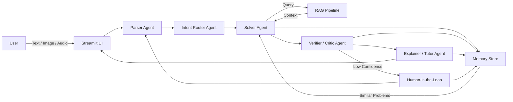

# 🧮 AI Math Mentor

An end-to-end **multimodal AI system** that solves JEE-style math problems using **RAG**, **multi-agent reasoning**, **Human-in-the-Loop**, and **memory-based learning**.

---

## ✨ Features

- 📝 Text / Image / Audio input  
- 🖼️ OCR for images + 🎤 ASR for audio  
- 🧠 Multi-Agent Architecture  
  - Parser Agent  
  - Intent Router Agent  
  - Solver Agent  
  - Verifier / Critic Agent  
  - Explainer / Tutor Agent  
- 📚 RAG-based solving using FAISS  
- ✅ Verification & Confidence scoring  
- 🧑‍💻 Human-in-the-Loop feedback  
- 🧬 Self-learning memory  
- 🖥️ Streamlit UI  

---

## 🛠️ Tech Stack

- Python, Streamlit  
- FAISS, SentenceTransformers  
- Gemini API  
- SymPy  
- SQLite / JSON Memory  

---

## 🏗️ System Architecture



---

## ▶️ How to Run

```bash
pip install -r requirements.txt
streamlit run app.py
```

---

## 📦 Deliverables

- ✅ Multimodal AI application  
- ✅ RAG pipeline with FAISS  
- ✅ Multi-agent architecture  
- ✅ HITL workflow  
- ✅ Memory & self-learning  
- ✅ Deployed Streamlit app  

---

## 🧪 Example Capabilities

- Image → OCR → Solve → Explain  
- Audio → ASR → Solve → Explain  
- Text → Solve → Explain  
- Low confidence → Human feedback → Memory update  

---

## 📌 Notes

This project demonstrates a complete AI system with reasoning, retrieval, verification, learning, and deployment — designed specifically for JEE-level mathematics problem solving.

